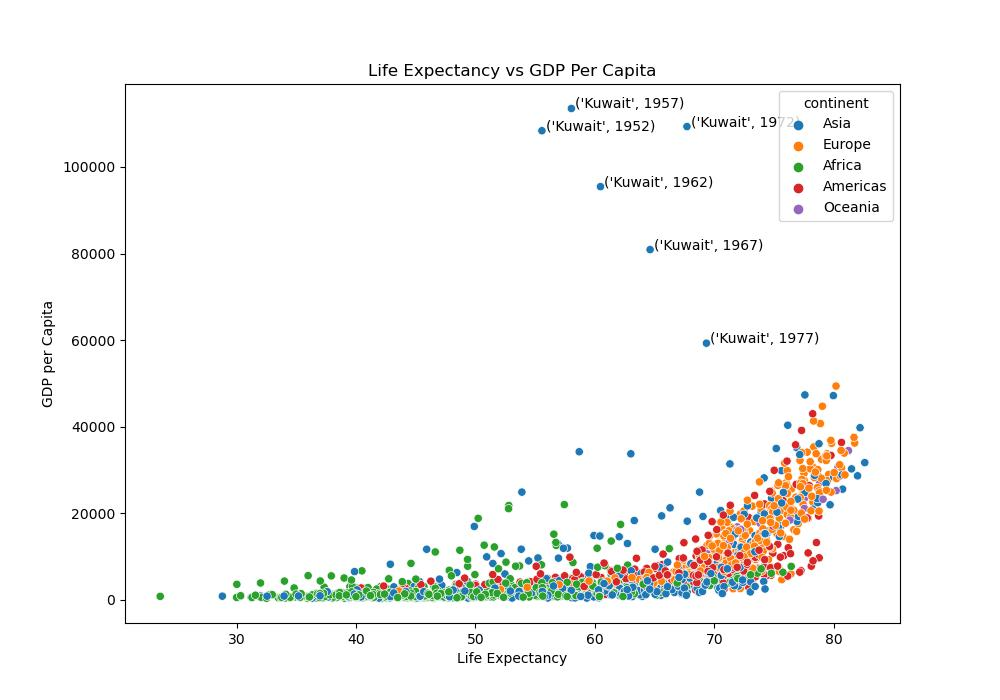
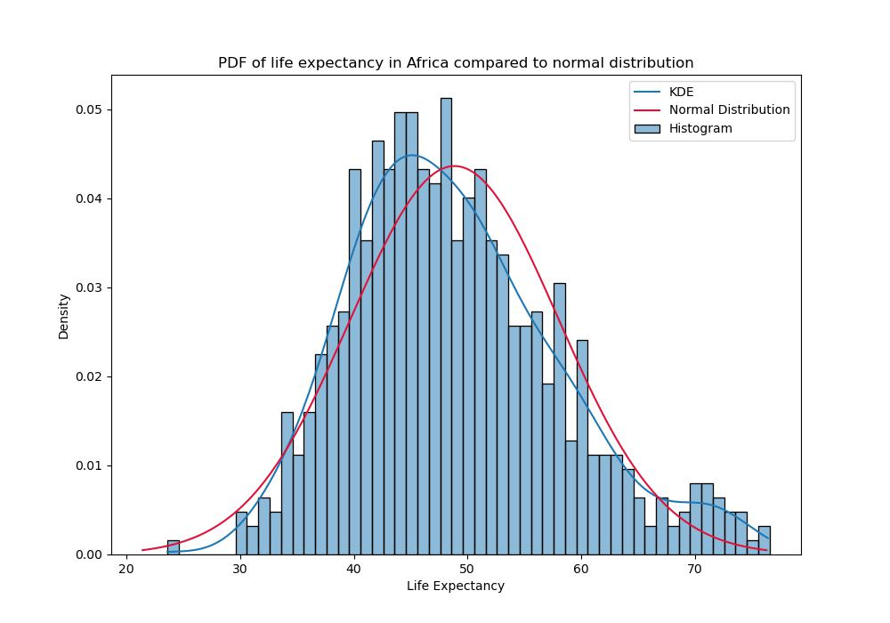

# hw-gapminder

## Instructions to create the figures

```
make all
```


## Question 1 -- distribution of life expectancy by continent

Use histograms to visualize the distribution of life expectancy for each continent.
Briefly describe any features that seem significant. 
Make sure your plots are labeled and easy to read. 
Put all the plots in one figure with a title.
Look at the seaborn [FacetGrid API reference](https://seaborn.pydata.org/generated/seaborn.FacetGrid.html)
for data-viz ideas.


The distributions of life expectancy vary greatly for each of the five continents in the gapminder dataset. Europe and the Americas are greatly left-skewed with the majority of life expectancies between 65 and 80. Asia is also left skewed although the peak is less pronounced, with a wider distribution of life expectancies. Oceania, with a comparitively small amount of countries, has the highest median life expectancy: 73.6 years. Unlike the other continents, Africa is right skewed and has a significantly lower median life expectancy: 47.8 years.

## Question 2 -- time evolution of life expectancy by continent

For each continent, use box-and-whisker plots to visualize the time evolution of life expectancy by 
continent (i.e., for each year in the dataset from 1952 to 2007).
Comment briefly on the dominant features you see in the data.
As in Question 2, make sure your plots are labeled and easy to read, and put all the plots in one figure with a title.
Look at the seaborn [FacetGrid API reference](https://seaborn.pydata.org/generated/seaborn.FacetGrid.html)
for ideas.


Life expectancy has increased steadily over time for each of the 5 continents, with notable variations in the overall distributions for each continent. The range of values (between maximum and minimum life expectancy) has gotten noticably smaller over time for Asia and the Americas, whereas the opposite is true for Africa; although the median life expectancy has increased over time for Africa, the size of the distribution of values has increased.

## Question 3 -- life expectancy vs GDP

Use scatter plots to visualize the relationship between life expectancy and GDP per capita for each continent.
Compare the use of linear and log scales for GDP. 
Comment on the relationships that seem significant and any outliers you notice.




GDP per capita plotted on a log scale presents a much clearer picture of the differences in continents compared to when it is graphed on a linear scale. In fact, GDP per capita and life expectancy appear "linearly" correlated when GDP is on a log scale.

There are extreme outliers in the linear plot, which I've labeled as past years of Kuwait. In recent years, Kuwait's GDP per capita has decreased.

When reading the log scale scatterplot, it is clear the countries in Europe and the Americas have relatively high GDP per capita and life expectancy compared to Africa. Asia has a wide distribution across both variables.

## Question 4 -- PDF of life expectancy

* Overlay the normal (Gaussian) distribution on a normalized version of the histogram for the entire dataset.
* Include the KDE, which is discussed here: [Kernel Density Estimation](https://seaborn.pydata.org/tutorial/distributions.html#kernel-density-estimation) -- pydata.org
* From ISLR2 p156: kernel density estimator is essentially a smoothed version of a histogram
* Consider using [scipy.stats.norm](https://docs.scipy.org/doc/scipy/reference/generated/scipy.stats.norm.html) -- scipy.org
* Comment briefly on the result (i.e., explain the dominant features in the chart with a few sentences).
  * Make sure to use the results in previous questions to justify your interpretation.


The life expectancy density distribution for the entire dataset differs greatly from the normal distribution. Life expectancy has a somewhat bimodal distribution with peaks around 45 years and 73 years. The bimodal distribution is due to Africa having such a different distribution than the other continents. In fact, when visualizing life expectancies for African countries alone, the distribution looks closer to normal, although slightly right skewed.



### Data

This assignment uses a subset of the [gapminder dataset](https://www.gapminder.org/data/) 
that is available as "gapminder" in an [R package](https://cran.r-project.org/web/packages/gapminder/README.html).
The "gapminder" dataset in R is dataset available via `library(gapminder); gapminder` in R. 
Do not use the larger dataset that's available in R as "gapminder_unfiltered".
You can get a [text file](https://github.com/jennybc/gapminder#plain-text-delimited-files)
for the gapminder subset directly from the [jennybc github repo](https://github.com/jennybc/gapminder).
The easiest way to get the data into Python is from the text file: 
[gapminder.tsv](https://github.com/jennybc/gapminder/blob/main/inst/extdata/gapminder.tsv)

### Note: if seaborn hangs your mac terminal

For those of us using an older mac...

* For some reason (python not installed as a framework?), plt.show() with seaborn hangs my terminal.  
* Fix this by turning off interactive mode:
```
plt.ioff()
```
* You can also fix this by using a different backend:
```
matplotlib.use('TkAgg')
```
* List all the backends and the current backend with
```
print(plt.get_backend())
print(matplotlib.rcsetup.all_backends)
```
* Or you can add the following to `~/.zprofile` to avoid a hang with the default backend
```
# Avoids seaborn hang on my old macbook pro
export MPLBACKEND=qtagg
```

### FacetGrid

Use Seaborn's FacetGrid for this assignment...

* Seaborn overview
  * [Overview](https://seaborn.pydata.org/tutorial/function_overview.html) -- tutorial introduces “relational”, “distributional”, and “categorical” modules (plot types)
    * [seaborn.displot](https://seaborn.pydata.org/generated/seaborn.displot.html) API reference
  * Seaborn docs: [figure-level vs axes-level functions](https://seaborn.pydata.org/tutorial/function_overview.html)
* "Matplotlib offers good support for making figures with multiple axes"
  * "Seaborn builds on top of this to directly link the structure of the plot to the structure of your dataset."
  * [Mutiplot grids](https://seaborn.pydata.org/tutorial/axis_grids.html) tutorial
* FacetGrid is a seaborn class that enables "faceting"
  * "facet" (the verb) means to look simultaneously at the various dimensions ("facets", the noun) of your dataset
  * [seaborn.FacetGrid](https://seaborn.pydata.org/generated/seaborn.FacetGrid.html) API reference
  * Use the [FacetGrid.set()](https://seaborn.pydata.org/generated/seaborn.FacetGrid.set.html) method to set attributes on each of the subplot axes
  * [scatterplot with continuous hues & sizes](https://seaborn.pydata.org/examples/scatterplot_sizes.html) example
  * [FaceGrid.map_dataframe()](https://seaborn.pydata.org/generated/seaborn.FacetGrid.map_dataframe.html) API reference


